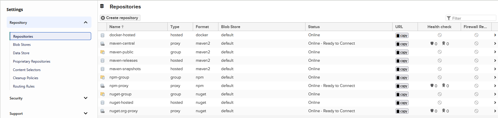
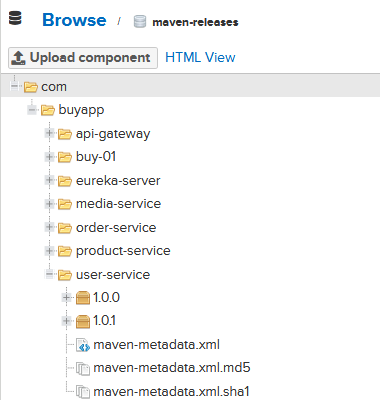
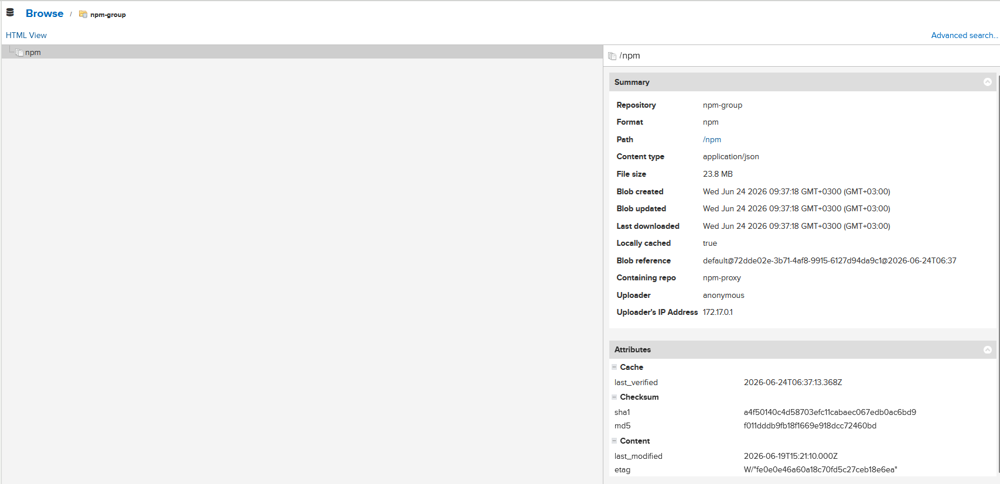
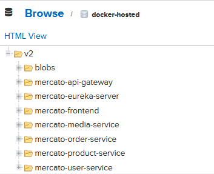
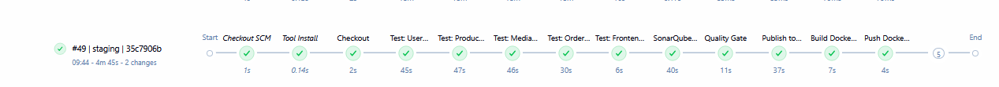
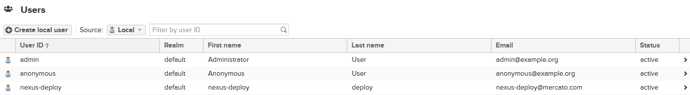
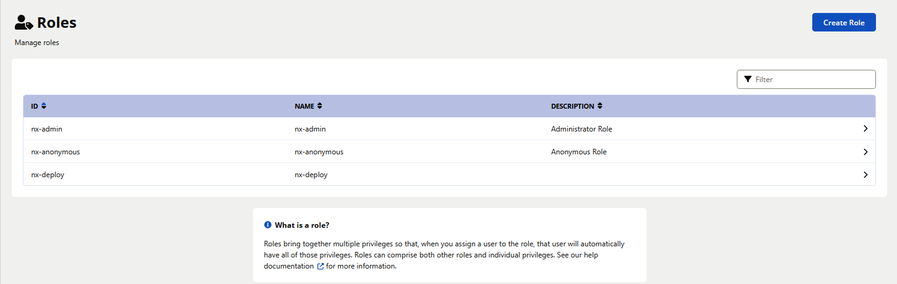
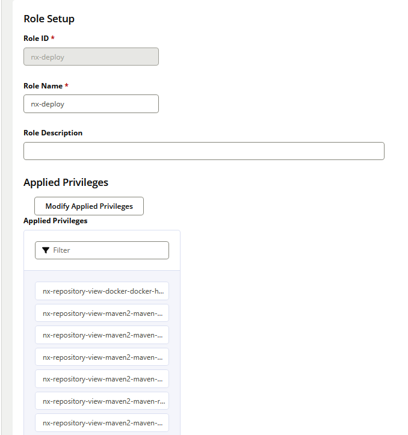
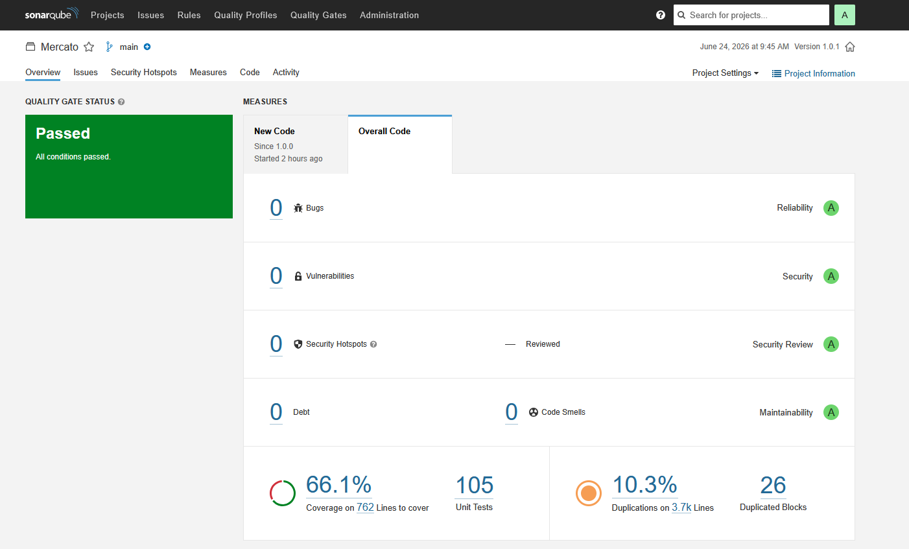

# Mercato — Nexus Repository Manager Integration

> **Project:** Nexus Repository Manager setup and CI/CD integration for the Mercato e-commerce microservices platform (buy-02).

---

## Table of Contents

1. [Project Overview](#project-overview)
2. [Architecture](#architecture)
3. [Nexus Setup & Configuration](#nexus-setup--configuration)
4. [Repository Configuration](#repository-configuration)
5. [Maven Integration](#maven-integration)
6. [npm Integration](#npm-integration)
7. [Docker Integration](#docker-integration)
8. [CI/CD Pipeline](#cicd-pipeline)
9. [Artifact Versioning](#artifact-versioning)
10. [Security & Access Control (RBAC)](#security--access-control-rbac)
11. [SonarQube Quality Gate](#sonarqube-quality-gate)

---

## Project Overview

This project integrates **Sonatype Nexus Repository Manager** into the Mercato microservices platform. Nexus serves as the central artifact store for:

- Maven JARs (Spring Boot microservices)
- Docker images (containerized services)
- npm packages (Angular frontend dependencies)

The CI/CD pipeline (Jenkins) automatically builds, tests, and publishes artifacts to Nexus on every code push.

**Application:** Mercato — a full-stack e-commerce platform built with:

- **Backend:** Spring Boot microservices (Java 17, Maven)
- **Frontend:** Angular 17
- **Infrastructure:** Kafka, MongoDB, MinIO, Eureka, API Gateway

---

## Architecture

```
GitHub Push
    │
    ▼
Jenkins Pipeline
    │
    ├── Test (parallel: 4 backend services + frontend)
    ├── SonarQube Analysis
    ├── Quality Gate
    ├── Publish JARs ──────────► Nexus (maven-releases)
    ├── Build Docker Images
    ├── Push Docker Images ────► Nexus (docker-hosted)
    ├── Deploy (docker-compose)
    └── Health Check
```

---

## Nexus Setup & Configuration

### Installation

Nexus runs as a Docker container using the official `sonatype/nexus3` image. It runs under the built-in `nexus` user (UID 200) — **never as root**.

**`nexus-compose.yml`:**

```yaml
services:
  nexus:
    image: sonatype/nexus3:latest
    container_name: nexus
    restart: unless-stopped
    ports:
      - "8091:8081" # Nexus UI
      - "8086:8086" # Docker registry
    volumes:
      - nexus-data:/nexus-data
    environment:
      - INSTALL4J_ADD_VM_PARAMS=-Xms512m -Xmx1200m -XX:MaxDirectMemorySize=2703m
volumes:
  nexus-data:
```

**Start Nexus:**

```bash
docker-compose -f nexus-compose.yml up -d
```

**Access Nexus UI:** `http://localhost:8091`

---

## Repository Configuration

All repositories are configured via Nexus UI at **Settings → Repository → Repositories**.



| Repository      | Type   | Format | Purpose                          |
| --------------- | ------ | ------ | -------------------------------- |
| maven-releases  | hosted | maven2 | Stores versioned JAR artifacts   |
| maven-snapshots | hosted | maven2 | Stores snapshot artifacts        |
| maven-central   | proxy  | maven2 | Proxies Maven Central            |
| maven-public    | group  | maven2 | Groups all Maven repos           |
| docker-hosted   | hosted | docker | Stores Docker images (port 8086) |
| npm-proxy       | proxy  | npm    | Proxies npmjs.org                |
| npm-group       | group  | npm    | Groups npm repos                 |

---

## Maven Integration

### settings.xml

Maven is configured to route all dependency downloads through Nexus and publish artifacts to Nexus repositories.

**`settings.xml`:**

```xml
<settings>
  <servers>
    <server>
      <id>nexus-releases</id>
      <username>${nexus.username}</username>
      <password>${nexus.password}</password>
    </server>
    <server>
      <id>nexus-group</id>
      <username>${nexus.username}</username>
      <password>${nexus.password}</password>
    </server>
  </servers>

  <mirrors>
    <mirror>
      <id>nexus-group</id>
      <mirrorOf>*</mirrorOf>
      <url>http://host.docker.internal:8091/repository/maven-public/</url>
    </mirror>
  </mirrors>
</settings>
```

### Publishing Artifacts

Artifacts are published via the Jenkins pipeline using:

```bash
mvn deploy -B -DskipTests \
    -s settings.xml \
    -Dnexus.url=http://host.docker.internal:8091 \
    -Dnexus.username=nexus-deploy \
    -Dnexus.password=****
```

### Published Artifacts

All 7 microservice JARs are published to `maven-releases`, including two versions (1.0.0 and 1.0.1):



**Artifacts published:**

- `com.buyapp:buy-01` (parent POM)
- `com.buyapp:eureka-server`
- `com.buyapp:api-gateway`
- `com.buyapp:user-service`
- `com.buyapp:product-service`
- `com.buyapp:media-service`
- `com.buyapp:order-service`

### Retrieving an Artifact

To pull a specific artifact version from Nexus:

```bash
mvn dependency:get \
  -Dartifact=com.buyapp:user-service:1.0.1 \
  -DremoteRepositories=http://localhost:8091/repository/maven-releases/
```

---

## npm Integration

The Angular frontend dependencies are cached through Nexus npm proxy.

### Configuration

**`frontend/.npmrc`:**

```
registry=http://host.docker.internal:8091/repository/npm-group/
```

### npm Cache in Nexus

All Angular packages are cached in Nexus after the first pipeline run:



- **Repository:** npm-group
- **Format:** npm
- **Locally cached:** true
- **File size:** 23.8 MB

Subsequent builds pull packages from Nexus instead of the public internet, significantly reducing build times.

---

## Docker Integration

### Docker Repository Setup

A hosted Docker registry is configured in Nexus on port 8086:

- **Repository name:** docker-hosted
- **Type:** hosted
- **HTTP port:** 8086

### Configuring Insecure Registry

Add to Docker Desktop → Settings → Docker Engine:

```json
{
  "insecure-registries": ["localhost:8086", "host.docker.internal:8086"]
}
```

### Publishing Docker Images

Images are pushed via the Jenkins pipeline:

```bash
docker login host.docker.internal:8086 -u nexus-deploy --password-stdin

docker tag mercato-user-service:latest host.docker.internal:8086/mercato-user-service:1.0.1
docker push host.docker.internal:8086/mercato-user-service:1.0.1
docker push host.docker.internal:8086/mercato-user-service:latest
```

### Published Images

All 7 service images are stored in Nexus with build-label tags and `latest`:



**Images stored:**

- `mercato-eureka-server`
- `mercato-api-gateway`
- `mercato-user-service`
- `mercato-product-service`
- `mercato-media-service`
- `mercato-order-service`
- `mercato-frontend`

### Pulling an Image from Nexus

```bash
docker pull host.docker.internal:8086/mercato-user-service:latest
```

---

## CI/CD Pipeline

The Jenkins pipeline automatically triggers on every GitHub push via webhook (ngrok tunnel).

### Pipeline Stages



| Stage                | Description                                        |
| -------------------- | -------------------------------------------------- |
| Checkout SCM         | Fetches Jenkinsfile from GitHub                    |
| Checkout             | Clones Mercato repository                          |
| Test                 | Runs unit tests in parallel (4 backend + frontend) |
| SonarQube Analysis   | Static code analysis                               |
| Quality Gate         | Fails pipeline if quality gate not passed          |
| Publish to Nexus     | Deploys JARs to maven-releases                     |
| Build Docker Images  | Builds all service images                          |
| Push Docker to Nexus | Tags and pushes images to docker-hosted            |
| Save Rollback State  | Tags current images as `:rollback`                 |
| Deploy               | Runs `docker-compose up -d`                        |
| Health Check         | Verifies all services return `{"status":"UP"}`     |
| Rollback             | Restores previous images on failure                |

### Triggering the Pipeline

The pipeline triggers automatically on every `git push` to the `main` branch. It can also be triggered manually from Jenkins UI with parameters:

- `ENVIRONMENT` — staging or production
- `MERCATO_BRANCH` — branch to build (default: main)
- `SKIP_TESTS` — skip test stage
- `FORCE_DEPLOY` — deploy even if health checks fail

### Example: Manual Trigger

```bash
git commit --allow-empty -m "trigger: manual pipeline run"
git push origin main
```

---

## Artifact Versioning

Versioning is managed through Maven's `pom.xml`. The parent POM version propagates to all child modules.

### Bumping Version

```bash
cd backend
mvn versions:set -DnewVersion=1.0.1 -DgenerateBackupPoms=false
```

### Multiple Versions in Nexus

Both `1.0.0` and `1.0.1` are available in `maven-releases`:


This enables:

- **Rollback** — redeploy a previous version by referencing its artifact
- **Traceability** — each build is tagged with version + commit SHA (e.g., `49-35c7906b`)
- **Dependency pinning** — other services can depend on a specific version

---

## Security & Access Control (RBAC)

### Users

A dedicated deployment user `nexus-deploy` is created with minimal permissions — not the admin account.



| User         | Role         | Purpose                   |
| ------------ | ------------ | ------------------------- |
| admin        | nx-admin     | Full administration       |
| anonymous    | nx-anonymous | Read-only public access   |
| nexus-deploy | nx-deploy    | CI/CD artifact publishing |

### Roles

A custom role `nx-deploy` is created with only the privileges needed for CI/CD:





**Privileges assigned to `nx-deploy`:**

- `nx-repository-view-docker-docker-hosted-*` — full access to docker-hosted
- `nx-repository-view-maven2-maven-releases-*` — full access to maven-releases
- `nx-repository-view-maven2-maven-snapshots-*` — full access to maven-snapshots
- `nx-repository-view-maven2-maven-central-browse` — browse maven-central proxy
- `nx-repository-view-maven2-maven-central-read` — read from maven-central proxy
- `nx-repository-view-maven2-maven-public-browse` — browse maven-public group
- `nx-repository-view-maven2-maven-public-read` — read from maven-public group

### Jenkins Credentials

The `nexus-deploy` credentials are stored securely in Jenkins credential store (ID: `nexus-credentials`) and injected at runtime — never hardcoded in the pipeline.

```groovy
withCredentials([usernamePassword(
    credentialsId: 'nexus-credentials',
    usernameVariable: 'NEXUS_USER',
    passwordVariable: 'NEXUS_PASS'
)]) {
    sh "mvn deploy -Dnexus.username=${NEXUS_USER} -Dnexus.password=${NEXUS_PASS}"
}
```

---

## SonarQube Quality Gate

Every pipeline run includes a SonarQube analysis stage. The pipeline aborts if the quality gate fails.



**Quality Gate Results (v1.0.1):**

- Bugs: 0
- Vulnerabilities: 0
- Security Hotspots: 0 (Reviewed)
- Code Smells: 0
- Coverage: 66.1% on 762 lines
- Unit Tests: 105 passing
- Reliability: A
- Security: A
- Maintainability: A
